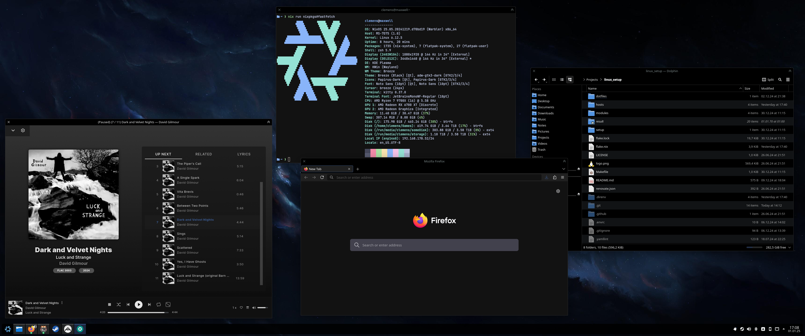

[dotfiles etc. are here](https://github.com/clemak27/linux_setup)

I currently use [Nix](https://nixos.org/) on all my machines where possible.
Having used multiple distros/DE in the past (Mint, (K)Ubuntu, Arch,
Silverblue/Kinoite), I fell in the Nix-hole some years ago and have been using
it since.

I love the deterministic configuration of my whole system and the flexibility of
nix shell etc. to manage project-specific dependencies.

Here is a current screenshot of my main system:

If you are interested in the hardware details of my main PC:

| Hardware     | -                                               |
| ------------ | ----------------------------------------------- |
| CPU + cooler | AMD Ryzen 9 7900X + BE QUIET! Pure Rock 2 Black |
| Mainboard    | MSI MAG B650 TOMAHAWK WIFI                      |
| RAM          | CORSAIR Vengeance 32GB, DDR5-6000               |
| GPU          | SAPPHIRE AMD Radeon RX 6700 XT Pulse            |
| Main disk    | Samsung 970 EVO NVMe M.2 SSD 500GB              |
| Games disk   | Samsung SSD 870 EVO Sata III                    |
| Storage disk | Seagate IronWolf 4TB                            |
| Monitor 1    | Dell 34 Curved Gaming Monitor – S3422DWG        |
| Monitor 2    | AOC 24G2                                        |
| Audio        | Fiio BTR5 + Sennheiser IE100 Pro                |

As for the software side:

| Software     | -                                                 |
| ------------ | ------------------------------------------------- |
| OS           | [NixOS](https://nixos.org/)                       |
| DE           | [KDE Plasma 6](https://kde.org/)                  |
| Browser      | [Firefox](https://www.mozilla.org/en-US/firefox/) |
| Terminal     | [kitty](https://sw.kovidgoyal.net/kitty/)         |
| Music Player | [feishin](https://github.com/jeffvli/feishin)     |
| Texteditor   | [neovim](https://neovim.io/)                      |
| PIM          | [Kontact](https://userbase.kde.org/Kontact)       |
| Shell        | zsh                                               |
| Multiplexer  | zellij                                            |
